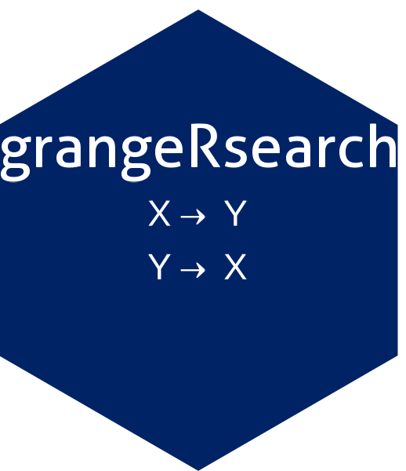

# grangersearch 

An R package for exhaustive Granger causality testing with tidyverse integration.

## Overview

`grangersearch` provides a simple interface for performing Granger causality tests on time series data. The package wraps the `vars` infrastructure while providing a streamlined interface for exploratory causal analysis.

Key features include:

- **Exhaustive pairwise search**: Automatically discover Granger-causal relationships across multiple variables
- **Classic and constrained methods**: Traditional VAR-based testing or single-lag constrained formulation
- **GC strength measure**: Continuous log-variance ratio quantifying causality magnitude
- **Automatic lag optimization**: Systematic evaluation of multiple lag orders with visualization
- **Auto-differencing**: Optional first-order differencing for stationarity preprocessing
- **Distribution analysis**: Analyze GC strength distributions across all variable pairs
- **Tidyverse compatibility**: Pipe operators (`|>`, `%>%`) and non-standard evaluation
- **Broom integration**: `tidy()` and `glance()` methods for structured output
- **Visualization**: Built-in plotting for causality matrices, distributions, and lag selection

## Installation

Install from GitHub:

```r
# install.packages("remotes")
remotes::install_github("nkorf/grangersearch")
```

## Quick Start

```r
library(grangersearch)

# Basic pairwise test
data(Canada, package = "vars")
result <- Canada |> granger_causality_test(e, U, lag = 2)
print(result)

# Get tidy results
tidy(result)

# Constrained Granger causality (single lag)
result_constrained <- Canada |>
  granger_causality_test(e, U, lag = 2, type = "constrained")

# With auto-differencing for non-stationary data
result_diff <- Canada |>
  granger_causality_test(e, U, lag = 2, difference = TRUE)

# Exhaustive search across multiple variables
search_results <- Canada |> granger_search(lag = 2)
plot(search_results)  # Causality matrix visualization

# Distribution analysis of GC strength
dist <- Canada |> granger_distribution(lag = 2)
plot(dist)  # Histogram of GC strength values

# Lag selection analysis
lag_analysis <- Canada |> granger_lag_select(e, U, lag = 1:8)
plot(lag_analysis)
```

## Main Functions

| Function | Description |
|----------|-------------|
| `granger_causality_test()` | Test Granger causality between two time series |
| `granger_search()` | Exhaustive pairwise search across multiple variables |
| `granger_distribution()` | Analyze GC strength distribution across all pairs |
| `granger_lag_select()` | Analyze results across different lag orders |
| `tidy()` / `glance()` | Broom-style tidying of results |

## Example Output

```
Granger Causality Test (classic)
================================

Observations: 84, Lag: 2, Significance level: 0.050

e -> U: * e Granger-causes U (p = 0.0000, strength = 0.592)
U -> e:   U does not Granger-cause e (p = 0.2983, strength = 0.030)
```

## Citation

If you use this package, please cite:

> Korfiatis, N. (2025). grangersearch: An R Package for Exhaustive Granger Causality Testing with Tidyverse Integration. arXiv preprint. https://arxiv.org/abs/XXXX.XXXXX

## Author

**Nikolaos Korfiatis**
Department of Informatics, Ionian University
Corfu, Greece
nkorf@ionio.gr

## License

MIT
